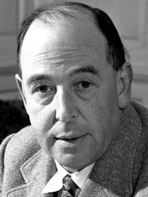

# Biên Niên Sử Narnia   TẬP 1 - Cháu Trai Pháp Sư

> c. s. lewis
>
> dịch giả: hồng vân

## Giới thiệu bộ truyện

Biên niên sử về Narnia viết về một thế giới tưởng tượng, những phép màu và một thế giới song song cùng tồn tại với thế giới của chúng ta. Biên niên sử về Narnia dựng nên một thế giới tưởng tượng, kỳ ảo nhưng có những cơ sở của hiện thực - điểm khác biệt với Harry Potter. Biên niên sử về Narnia là một tác phẩm hư cấu có giá trị nghệ thuật cao trên nhiều phương diện:

Một tác phẩm có cấu trúc cân đối, hoàn chỉnh, tính tư tưởng quán xuyến từ đầu đến cuối ; là tinh thần đấu tranh cho chính nghĩa, cho con người, đặc biệt là một tình yêu thiên nhiên, hoà mình với thiên nhiên, coi cỏ cây hoa lá, muông thú cũng có tính bản thiện và có nhu cầu được cộng sinh trong thế giới của muôn loài và cho muôn loài. Một tư tưởng rất nhân bản và đang được nhân loại đề cao. Bộ sách giúp bạn đọc có ý thức tốt hơn về môi trường thiên nhiên cũng như môi trường văn hoá. Và đặc biệt có thể nhìn cuộc đời với một đôi mắt “ngây thơ” hơn.

Tác phẩm hấp dẫn nhờ một cốt truyện cổ điển, có mâu thuẫn, cao trào và giải quyết mâu thuẫn, thể hiện một trí tưởng tượng rất cao, mang dấu ấn của cá tính sáng tạo của nhà văn. Từ tập 1 đến tập 7, thế giới tưởng tượng được xây dựng và phát triển một cách vừa khác biệt vừa nhất quán với toàn bộ và theo cấp độ tăng tiến, khiến người đọc đi từ ngạc nhiên này đến ngạc nhiên khác với những hình tượng độc đáo, kỳ thú không hề bị lặp lại.

Tác phẩm đưa ra một hệ thống nhân vật phong phú, có cá tính: không có nhân vật nào lẫn với nhân vật nào, dù là con vật hay con người đều có những nét đặc biệt đáng ghi nhớ. Lối giải quyết mâu thuẫn của tác giả, tự nhiên, không gượng ép và đặc biệt là nhẹ nhàng, thoải mái không gây nên những cảnh quá dữ dội có thể ảnh hưởng đến tâm hồn trẻ thơ.

Theo bình chọn của tạp chí Big Reader: Biên niên sử về Narnia có tên trong danh sách 21 cuốn sách được độc giả Anh yêu thích nhất (trong danh sách 100 tiểu thuyết thế giới).

Bộ truyện được chuyển thể sang tác phẩm điện ảnh trở thành là bộ phim ăn khách của thế kỷ 21.

Đôi nét về tác giả

C.S. Lewis

C.S. Lewis (Clive Staples Lewis) sinh 29 - 11 -1898 tại Belfast. Ông làm nghiên cứu sinh và là trợ giảng bộ môn Văn học Anh tại trường Magdalen, Oxford và sau này là giáo sư bộ môn Văn học thời kỳ Trung cổ và Phục hưng tại Đại học Cambridge, nơi ông làm việc cho đến khi qua đời vào ngày 22- 11 - 1963, Oxford,

Ông viết rất nhiều sách về phê bình văn học và Đạo cơ đốc, với tác phẩm nổi tiếng “The Screwtape Letters”, cùng với bốn cuốn tiểu thuyết khác dành cho người lớn. Những tác phẩm của ông được dịch sang nhiều thứ tiếng và bán được hàng triệu bản. Bộ truyện bảy tập “Biên niên sử Narnia” là bộ truyện duy nhất ông viết cho trẻ em và đã xuất sắc trở thành một trong những tác phẩm kinh điển trong dòng văn học thiếu nhi thế giới.

CÁC NHÂN VẬT TRONG BỘ SÁCH NÀY

Aslan: Vua, chúa tể của cả khu rừng và là con trai của vị hoàng đế thống trị cả một vùng biển. Aslan là một con sư tử, một con sư tử vĩ đại. Nó đến và đi khi nó muốn; nó tới để đánh lại mụ phù thủy và cứu Narnia. Aslan xuất hiện trong cả bảy tập truyện.

Digory Kirke: Digory có mặt từ ngay tập đầu Cháu trai pháp sư và nhân vật này cũng xuất hiện trong tập Sư tử, phù thủy và cái tủ áo. Nếu không từ sự dũng cảm của Digory, có lẽ chúng ta sẽ không bao giờ được nghe về Narnia. Hãy tìm hiểu nguyên nhân tại sao ở tập Cháu trai pháp sư.

Polly Plummer: Polly là người đầu tiên rời khỏi thế giới của chúng ta. Cô ấy cùng với Digory xuất hiện ngay từ đầu trong tập Cháu trai pháp sư.

Jadis: Hoàng hậu cuối cùng của Charn, một vùng đất bị chính bà ta hủy diệt. Jadis tới vùng đất Narnia cùng với Digory và Polly trong tập Cháu trai pháp sư và thống trị vùng đất này trong vai trò là mụ Bạch Phù Thủy trong tập Sư tử, phù thủy và cái tủ áo. Một kẻ quỷ quyệt, bà ta là một người rất nguy hiểm, thậm chí cả trong tập truyện Chiếc ghế bạc.

Bác Andrew: Ngài Andrew Ketterly nghĩ ông ta chính là một pháp sư nhưng giống như tất cả những người nhúng mũi vào pháp thuật, ông ta không thực sự biết mình đang làm gì. Kết quả là một điều khủng khiếp xảy ra trong tập Cháu trai pháp sư.

Những đứa trẻ nhà Pevensie

Peter Pevensie: Vua Peter Dũng mãnh

Susan Pevensie: Nữ hoàng Susan Hiền dịu

Edmund Pevensie: Vua Edmund Công chính

Lucy Pevensie: Nữ hoàng Lucy Can đảm

Bốn đứa trẻ nhà Pevensie đến thăm vùng đất Narnia vào mùa đông khi vùng đất đang bị Bạch Phù Thủy cai trị. Chúng đã ở đó trong nhiều năm của Narnia và thiết lập một thời đại Vàng cho Narnia. Peter là anh cả, kế đến là Susan, rồi tới Edmund và Lucy. Các nhân vật này xuất hiện trong tập Hoàng tử Caspian. Edmund và Lucy còn có mặt trong tập Trên con tàu Hướng tới Bình minh; Edmund, Lucy và Susan có mặt ở tập Con ngựa và cậu bé; Peter, Edmund và Lucy xuất hiện ở tập Trận chiến cuối cùng.

Shasta: Có một bí mật về đứa con nuôi của người ngư dân Calormene. Thực ra đó là một cậu bé rất khác thường và chính cậu phát hiện ra điều này trong tập Con ngựa và cậu bé.

Bree: Con chiến mã này cũng rất đặc biệt. Nó bị bắt khi còn là một con ngựa con trong khu rừng của Narnia và được bán làm ngựa thồ ở Calormen, một đất nước ở bên kia của Archenland và nằm xa phía nam của Narnia. Chuyến thám hiểm của nó thực sự bắt đầu khi nó cố bỏ trốn trong tập Con ngựa và cậu bé.

Aravis: Một cô gái Calormen quý tộc, nhưng cô lại có rất nhiều tính tốt và những đức tính này tỏa sáng trong tập Con ngựa và cậu bé.

Hwin: Một con ngựa tốt bụng và thông thái. Một nô lệ bị bắt khỏi vùng đất Narnia, nó và Aravis kết bạn với nhau trong tập Con ngựa và cậu bé.

Hoàng tử Caspian: Là cháu trai của vua Miraz và là Caspian 10, con trai của Caspian và là vị vua thực sự của Narnia (Vua của người Narnia cổ xưa). Cậu cũng được gọi là người Telmarine của vùng đất Narnia, chúa tể của Cair Paravel và hoàng đế của Quần đảo Đơn Côi (Lone islands). Cậu ta xuất hiện trong các tập: Hoàng tử Caspian, Trên con tàu Hướng tới Bình minh, Chiếc ghế bạc và Trận chiến cuối cùng.

Miraz: Một người Telmarine của vùng Telmar, một nơi nằm bên kia dãy núi phía tây (Tổ tiên của người Telmarine nguồn gốc là đến từ thế giới chúng ta) và là người cướp ngôi báu cai trị Narnia trong tập Hoàng tử Caspian.

Reepicheep: Là Con chuột thống lĩnh. Nó tự phong cho mình là một người hầu khiêm tốn của hoàng tử Caspian, và có lẽ là một hiệp sĩ dũng cảm nhất của vùng Narnia. Phong cách hiệp sĩ của nó cùng với sự dũng cảm và kỹ năng dùng kiếm thì không ai có thể vượt qua được. Reepicheep xuất hiện trong các tập: Hoàng tử Caspian, Trên con tàu Hướng tới Bình minh và Trận chiến cuối cùng.

Eustace Clarence Lông Vịt: Là một người họ hàng của gia đình Pevensie, người mà Edmund và Lucy phải đến thăm. Cậu ta đã sốc khi thấy Narnia. Nhân vật này có mặt trong các tập: Trên con tàu Hướng tới Bình minh, Chiếc ghế bạc và Trận chiến cuối cùng.

Jill Pole: Một nữ anh hùng trong tập Chiếc ghế bạc. Cô đến Narnia cùng với Eustace trong chuyến đi thứ hai của Eustace đến vùng đất này. Cô ấy cũng xuất hiện để trợ giúp trong tập truyện: Trận chiến cuối cùng.

Hoàng tử Rillian: Con trai của vua Caspian 10, Rillian là hoàng tử bị lạc trong vùng đất Narnia, xuất hiện trong tập: Chiếc ghế bạc.

Puddleglum: Sống ở Khu đầm lầy phía đông của Narnia. Ông ta rất cao và hình thức khó coi của ông ta che đậy một trái tim nhân hậu và sự dũng cảm tuyệt vời. Nhân vật này xuất hiện ở tập: Chiếc ghế bạc và Trận chiến cuối cùng.

Vua Tirian: Cao cả và dũng cảm, Tirian là vị vua cuối cùng của Narnia. Cùng với người bạn Jewel, một con kỳ lân, vua Tirian đã chiến đấu trong Trận chiến cuối cùng.

Shift: Một con khỉ già cụt đuôi xấu xí. Shift quyết định là nó nên cai quản Narnia và bắt đầu làm những việc mà bản thân nó không thể dừng lại được trong tập Trận chiến cuối cùng.

Puzzle: Một con lừa không bao giờ làm hại người khác, không được thông minh cho lắm. Và Shift đã lừa nó trong Trận chiến cuối cùng.

CHÁU TRAI PHÁP SƯ

“Đây là tập truyện vô cùng quan trọng” như tác giả giải thích ngay từ đầu câu chuyện “vì nó cho thấy toàn bộ sự việc diễn ra đồng thời giữa thế giới chúng ta và sự hình thành của vùng đất Narnia”.

Vào cái mùa hè có thể coi là ẩm ướt và lạnh lẽo nhất so với những mùa hè khác. Polly và Digory quyết định khám phá tầng áp mái của ngôi nhà cũ cao lớn. Rất cẩn thận, chúng bước qua những thanh xà và luồn qua dãy hành lang tối nối liền hai ngôi nhà của chúng với một căn nhà hoang. Chúng sẽ phát hiện ra điều gì? Liệu đó có phải là căn nhà ma? Thậm trí có thể chúng còn phát hiện ra một băng nhóm tội phạm nữa cũng nên! Dù thế nào đi nữa thì chắc chắn phải liên quan đến một điều gì đó bí ẩn!

Hai đứa dường như đã hơi thất vọng khi tình cờ phát hiện ra căn phòng làm việc bí mật của bác Andrew, bác của Digory. Và chỉ khi những thí nghiệm lộn xộn của bác ấy làm Polly ngay lập tức biến mất khỏi thế giới hiện tại thì chúng mới nhận ra rằng, rõ ràng là kỳ nghỉ hè buồn tẻ của chúng đã biến thành một cuộc thám hiểm vô cùng kỳ lạ và hồi hộp.

Đây là chuyến thám hiểm đầu tiên trong bộ truyện hấp dẫn Biên niên sử về Narnia.

Giới thiệu bộ truyện

Tiến >>

Nguồn: VH-eP
Được bạn: Ct.Ly đưa lên
vào ngày: 25 tháng 10 năm 2021
